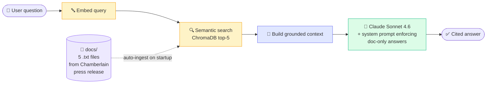

<div align="center">

# 🔒 myQ Secure View RAG Assistant

**Production RAG pipeline grounded in Chamberlain Group's myQ Secure View 3-in-1 Smart Lock docs.**

*Built as a live demo project for Chamberlain Group's GenAI Engineering team.*


[](https://chamberlain-secure-view.streamlit.app)

[Architecture](#-architecture) · [Quickstart](#-quickstart) · [Try it live](#-try-it)

</div>

---

## 🎯 What it is

A retrieval-augmented chat assistant grounded on **Chamberlain Group's myQ Secure View** — the 3-in-1 smart lock launched January 2026 (lock + doorbell + camera, AI-powered Smart Detection, fastest 2-second unlock).

Ask any question about the product. Every answer is cited from the official press release and product docs. If a question can't be answered from the docs, the assistant says so honestly instead of hallucinating.

## ✨ Features

| Feature | Status |
|---|---|
| 📚 Semantic RAG over real product docs (5 sources, 36 chunks) | ✅ Shipped |
| 🛡️ Grounded answers — no hallucinations, every claim sourced | ✅ Shipped |
| 🔗 FastAPI REST endpoint (`POST /chat`) for programmatic use | ✅ Shipped |
| 💬 Streamlit chat UI with example prompts | ✅ Shipped |
| 🐳 Dockerized for portable deploy | ✅ Shipped |
| ☁️ Deployed live on Streamlit Cloud | ✅ Shipped |
| 🔍 Hybrid retrieval (semantic + BM25) | 📋 Roadmap |
| 📊 RAGAS eval harness | 📋 Roadmap |

## 🏗️ Architecture



## 🛠️ Stack

| Layer | Technology |
|---|---|
| LLM | Anthropic Claude (Sonnet 4.6) |
| Vector store | ChromaDB (in-memory, rebuilt on startup) |
| Embeddings | ChromaDB default (sentence-transformers all-MiniLM-L6-v2) |
| API | FastAPI (`api.py`) |
| UI | Streamlit (`app.py`) |
| Container | Docker |
| Deployment | Streamlit Cloud (live) + Dockerfile ready for any container host |

## 📂 Knowledge base

The retrieval corpus is built from Chamberlain's official launch announcement, split into 5 topical documents:

- `secure_view_overview.txt` — product overview, CEO quote, positioning
- `ai_detection.txt` — AI-powered Smart Detection (people, vehicles, animals, packages, motion)
- `entry_methods_features.txt` — 5 entry methods, 2-second unlock, 2K HDR doorbell, battery life
- `myq_ecosystem.txt` — integrations with myQ Chime, Smart Garage Video Keypad, Outdoor Battery Camera
- `availability_company.txt` — January 6 / January 13 launch dates, regional restrictions

Total: 36 retrievable chunks.

## ⚡ Quickstart

```bash
git clone https://github.com/BQ77/chamberlain-rag
cd chamberlain-rag
python -m venv .venv && source .venv/bin/activate
pip install -r requirements.txt
echo "ANTHROPIC_API_KEY=sk-ant-..." > .env
```

**Run the Streamlit chat UI:**

```bash
streamlit run app.py
```

**Or run the FastAPI REST endpoint:**

```bash
uvicorn api:app --reload --port 8000
```

Then:

```bash
curl -X POST http://localhost:8000/chat \
  -H "Content-Type: application/json" \
  -d '{"question": "When did the myQ Secure View launch?"}'
```

**Or with Docker:**

```bash
docker build -t chamberlain-rag .
docker run -p 8000:8000 --env-file .env chamberlain-rag
```

## 🎮 Try it

Live demo: **[chamberlain-secure-view.streamlit.app](https://chamberlain-secure-view.streamlit.app)**

Sample questions the assistant handles:

| Question | What it does |
|---|---|
| *"When did the Secure View launch?"* | Cites availability_company.txt with Jan 6 / Jan 13 dates |
| *"What AI features does it have?"* | Cites ai_detection.txt with Smart Detection categories |
| *"How fast is the unlock?"* | Returns "2 seconds" from entry_methods_features.txt |
| *"What can it integrate with?"* | Cites myq_ecosystem.txt with Chime, Garage, Camera |
| *"What was the CEO's quote at launch?"* | Returns Jeff Meredith's quote from the press release |

## 🧠 Engineering choices

- **In-memory ChromaDB.** Corpus is small (36 chunks), rebuild-on-startup is faster than persistent storage and removes one moving part. For a corpus of 100K+ docs I'd switch to Chroma server or pgvector.
- **No LangChain.** Single-turn retrieve-then-generate doesn't justify the dependency footprint or abstraction layers. Raw Anthropic SDK + ChromaDB client is auditable and 30 lines shorter.
- **Strict grounding system prompt.** The model is instructed to answer only from retrieved context and to admit when it doesn't know. Reduces hallucination on out-of-scope questions.
- **Both UI and API ship.** Streamlit for human demo, FastAPI for programmatic integration. Same Docker image can serve either.

## 🗺️ Roadmap

- [x] Semantic retrieval with ChromaDB
- [x] Grounded answers with source citations
- [x] FastAPI REST endpoint
- [x] Streamlit chat UI
- [x] Dockerfile
- [x] Streamlit Cloud deployment
- [ ] Hybrid retrieval (BM25 + semantic) for compound queries
- [ ] Reranking layer (cross-encoder) for precision boost
- [ ] RAGAS evaluation: faithfulness, answer relevance, context precision
- [ ] Multi-doc ingestion (PDF, Markdown)
- [ ] AWS App Runner deployment via ECR

## 📄 License

MIT

---

<div align="center">

**Built for Chamberlain Group's GenAI Software Engineering Internship demo.**

</div>
